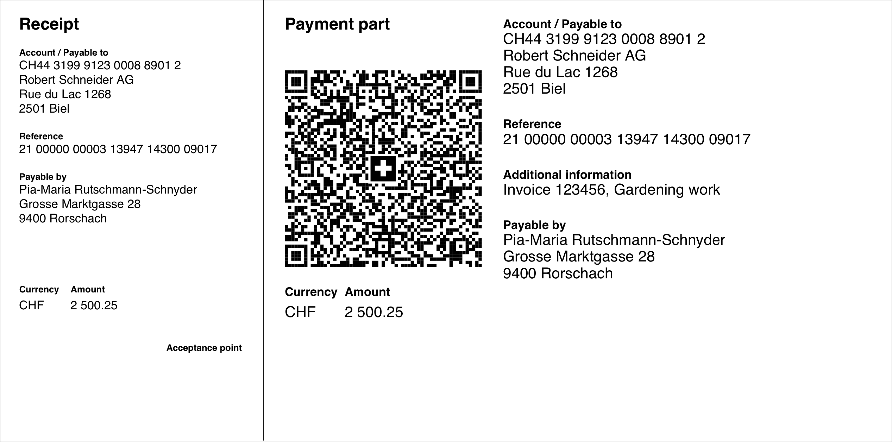

# Swiss QR Bill

[](https://github.com/sprain/php-swiss-qr-bill/actions)

A PHP library to create Swiss QR Bill payment parts (_QR-Rechnung_) which fully replaced the red and orange payment slips by September 30, 2022.




## Getting started

```
composer require sprain/swiss-qr-bill
```

Then have a look at [example/example.php](example/example.php).

## FAQs
* **Why is my IBAN not working?**<br>
A typical QR bill ([example](https://github.com/sprain/php-swiss-qr-bill/blob/master/example/example.php)) requires a special QR IBAN. You can get yours from your bank. A classic IBAN can be used for QR bills with a SCOR reference ([example](https://github.com/sprain/php-swiss-qr-bill/blob/master/example/example_scor.php)) or no reference number at all ([example](https://github.com/sprain/php-swiss-qr-bill/blob/master/example/example_minimal.php)).

* **How do I recognize a QR IBAN?**<br>
See https://github.com/sprain/php-swiss-qr-bill/issues/182#issuecomment-1229539977

* **How do I create QR bills for international IBANs?**<br>
You can't. The QR bill by specification only supports IBANs from Switzerland and Liechtenstein.

* **How do I support currencies other than CHF or EUR?**<br>
You can't. The QR bill by specification only supports CHF and EUR.

* **How do I make my QR bills payable by Twint?**<br>
See https://github.com/sprain/php-swiss-qr-bill/issues/129 

* **What PDF libraries are supported by this library?**<br>
The following libraries are currently actively supported:
  * [fpdf/fpdf](https://packagist.org/packages/fpdf/fpdf)
  * [tecnickcom/tcpdf](https://packagist.org/packages/tecnickcom/tcpdf)
  * [setasign/fpdi](https://packagist.org/packages/setasign/fpdi) (accepted by `FpdfOutput` and `TcPdfOutput`)

  The output of `HtmlOutput` is known to be used to generate PDFs with [PrinceXML](https://www.princexml.com), [Docraptor](http://docraptor.com), and [dompdf/dompdf](https://packagist.org/packages/dompdf/dompdf) (with some adjustments as decribed [here](https://github.com/sprain/php-swiss-qr-bill/issues/178#issuecomment-1222752493))


## Getting help

Do you need more help using this library?

* [Search the existing and closed issues](https://github.com/sprain/php-swiss-qr-bill/issues?q=is%3Aissue) to see if you find your answer there.
* If you still need help, you may [create an issue](https://github.com/sprain/php-swiss-qr-bill/issues) yourself to ask your question.

Please note that the maintainer of this library will not provide any support by email.
The beauty of open source software lies in the fact that everybody can benefit from each other. Therefore questions will only be answered in public.

## Versioning

[Semantic versioning](https://semver.org/) is used for this library.

In addition, a minor version will always be published if any visible change in the output of the qr code or the payment part takes place, even if it could be considered to be just a bugfix.

## Support the project

* Do you like this project? [Consider a Github sponsorship.](https://github.com/sponsors/sprain)
* Would you like to contribute? [Have a look at the open issues.](https://github.com/sprain/php-swiss-qr-bill/issues) Be nice to each other.
* Spread the word!


## Official resources
The repository contains the official specifications the library is based on:

- [Swiss Implementation Guidelines QR-bill](docs/specs/ig-qr-bill-en-v2.2.pdf)
- [Technical information about the QR-IID and QR-IBAN](docs/specs/qr-iid_qr-iban-en.pdf)
- [Style Guide QR-bill](docs/specs/style-guide-en.pdf)
- [Validation Tool](https://validation.iso-payments.ch/gp/qrrechnung/validation/)

For more official information see
- [https://www.six-group.com/en/products-services/banking-services/payment-standardization/standards/qr-bill.html](https://www.six-group.com/en/products-services/banking-services/payment-standardization/standards/qr-bill.html)
